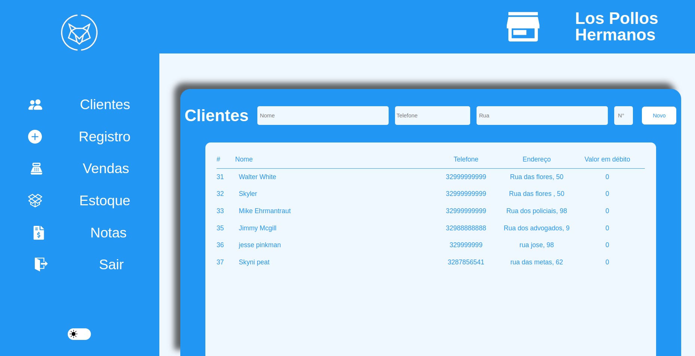

# Fox manager - gerenciador de frente de caixa


<p align="center">
   
</p>

## Demonstração

<p align="center">
   
   
   
   
   
   
</p>

***

## Como usar

Instale meu projeto e suas dependências

```bash
  git clone git@github.com:marcojr73/wolf-manager-pdv-front.git
```

```bash
  npm install
  
  npm run start
```

***

##	 Tecnologias e Conceitos

- Nexts.js
- styled-Componentes
- Dark theme and light theme
- Context API
- LocalStorage
- Toasts (react-toastify) 

***
    
